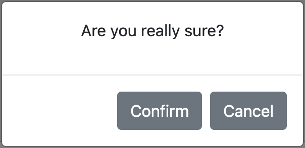

# jsconfirm-buttons
This is a plugin that depends on [Bootstrap](https://getbootstrap.com). The plugin does not need any specific version of bootstrap. If used, this plugin also provides integration with [jQuery](https://jquery.com), but it is not needed.

The plugin adds two type of buttons:
1. _confirmbutton_ that makes that any button show a confirmation modal dialog prior to executing the function that it should execute. It is useful for (e.g.) confirm submitting a dialog or deleting entries in a database.
1. _verifybutton_ that verifies that one condition is valid prior to executing the function that it should execute. It is useful for (e.g.) form verification.

The basic syntax to use the _confirmbutton_ plugin is to include a tag such as the next one:
```html
<button data-confirm="Are you sure?">clickme</button>
```

Then, when the button is clicked, a modal dialog such as the next one will be shown.


The basic syntax to use the _verifybutton_ plugin is to include a tag such as the next one:
```html
<button data-verify="return Math.random > 0.5" onclick="alert('accepted')">clickme</button>
```

Then, if the code inside the `data-verify` attribute does not return `true`, a modal dialog will be shown and the default action will not be carried out.

# Setup

## Serving from your servers
You can clone this repo and copy the main file into the appropriate folder, to serve using your server:

```console
$ git clone https://github.com/dealfonso/jsconfirm-buttons
$ cp jsconfirm-buttons/confirmbutton.js /path/to/my/html/folder
```

And in your html file
```html
<script src="confirmbutton.js"></script>
```

## Using a CDN

You can use this library directly from jsdelivr CDN

```html
<script src="https://cdn.jsdelivr.net/gh/dealfonso/jsconfirm-buttons/confirmbutton.min.js"></script>
```

# Using

It is possible to use _jsconfirm-buttons_ in a declarative way (i.e. including parameters in the html5 tags), or programmatically in a script.

## The declarative way

### Confirm Button
The basic syntax to use this plugin is to include the attribute _confirm_ in the button tag such as the next one:
```html
<button data-confirm="Are you sure?">clickme</button>
```

Then, when the button is clicked, a modal dialog such as the next one will be shown:


> _jsconfirm-buttons_ can also be used for links, by adding _confirm_ attribute to the `<a>` tag. Moreover it may also be used in any other components (such as images or list items).

Once the _Confirm_ button is clicked, the dialog will be closed and the activity in the button will continue (i.e. submit or execute any other click handler).

In case that the dialog is closed by other means but the _Confirm_ button, the activit in the button will not continue (i.e. the submission will be cancelled, and any other click handler will not be executed).

### Verify Button

The basic syntax to use this verify button pluggin is to include the attribute _data-verify_ in the button tag such as the next one:
```html
<button data-verify="return Math.random() > 0.5;">clickme</button>
```

Then, whenever the button is pushed, the code inside the `data-verify` attribute will be evaluated and, if it did not return `true`, the default action for the element will be cancelled.

The _button verify_ plugin can also be use for links (i.e. `<a>` tag), images, etc.

## The programmatical way
Once you have your interface, you can use the programmatical method to add both confirmation or verification to your components.

```html
<button id="mybutton">clickme</button>
<script>
    $(function() {
        let options = {
            confirm: "Are you sure?"
        };
        $('#mybutton').confirmButton(options);
    })
</script>
```

The result is the same than the previous one, but in this case, the `confirm` attribute is not set to the `<button>` tag and we initialize the button programmatically once the document is ready.

## Working together verification and confirmation

Both verification and confirmation can be set to the same button (or element). In the case of the declarative way, it is just needed to add both `data-verify` and `data-confirm` attributes to the tag, as in the next example:

```html
<button data-verify="return Math.random() > 0.5;" data-confirm="Are you sure?" onclick="alert('verified and confirmed')">clickme</button>
```

Using the declarative way, verification happens before: if `data-verify` does not evaluate to true, the confirmation dialog will not appear.

If wanted to verify **after** the confirmation, it is possible to use `data-verify-after-confirmation` instead `data-verify`:

```html
<button data-verify-after-confirmation="return Math.random() > 0.5;" data-confirm="Are you sure?" onclick="alert('confirmed and verified')">clickme</button>
```

Using the programmatical method, the developer decides whether to call `addconfirmation` or `addverification` first.

## Examples

### A button that has a onclick event handler

```html
<button data-confirm="Are you sure?" onclick="alert('confirmed')">clickme</button>
 ```

Once the button is clicked, a confirmation dialog (like in the previous image) will be shown. If the user clicks the _Confirm_ button, an alert will be shown.

[See at codepen](https://codepen.io/dealfonso/pen/GRvGagx)

 ### A button that has a jquery event handler

 ```html
<button data-confirm="Are you sure?" id="mybutton">clickme</button>
<script>
  $(function() {
    $("#mybutton").on('click', function() {
      alert('confirmed in a event handler');
    });
  })
</script>
```

Once the button is clicked, a confirmation dialog will be shown. If the user clicks the _Confirm_ button, the other handler will be executed, and so an alert will be shown.

[See at codepen](https://codepen.io/dealfonso/pen/RwZBmBy)

### A button that submits a form

```html
<form>
<input type="text" name="q">
<button data-confirm="Are you sure to submit?" type="submit">Send</button>
</form>
```

When the button _Submit_ is clicked, a confirmation dialog will be shown. If the user clicks the _Confirm_ button, the form will be submitted.

[See at codepen](https://codepen.io/dealfonso/pen/XWaBwxK)

### Using a custom modal dialog

```html
<div class="modal" tabindex="-1" id="myconfirmdlg" aria-hidden="true">
    <div class="modal-dialog">
        <div class="modal-content">
        <div class="modal-header">
            <h5 class="modal-title">Modal title</h5>
            <button type="button" class="btn-close" data-bs-dismiss="modal" aria-label="Close"></button>
        </div>
        <div class="modal-body">
            <h3>Are you sure you want to save data?</h3>
        </div>
        <div class="modal-footer">
            <button type="button" class="btn btn-secondary" data-bs-dismiss="modal">Close</button>
            <button type="button" class="btn btn-primary save">Save changes</button>
        </div>
        </div>
    </div>
</div>
<form>
    <input type="text" name="q">
    <button confirm data-dialog="#myconfirmdlg" data-confirmbtn="button.save" type="submit">Send</button>
</form>
```

[See at codepen](https://codepen.io/dealfonso/pen/BadPeqv)

The user provides a custom bootstrap modal dialog, and then sets the values for the `button` tag: 
- `confirm` attribute is set to blank, because the message is already in my dialog
- `data-dialog` is set to a selector that obtains the modal dialog that is wanted to show.
- `data-confirmbtn` is set to a selector that obtains the _Save_ button in the dialog (which will act as "confirm").


### Using in a link
```html
<a href="https://www.google.com" data-confirm="Want to go to google?" target="_blank">clickme</a>
```

The `confirm` attribute is set to the `<a>` tag. So the confirmation dialog will be show upon clicking and (if confirmed), the link will act and redirect to google.com.

[See at codepen](https://codepen.io/dealfonso/pen/LYjBoXz)

### Using in a any html component (e.g. `<li>`, ``, etc.)
```html
<ul>
    <li data-confirm="Confirm item 1">item 1</li>
    <li data-confirm="Confirm item 2">item 2</li>
    <li data-confirm="Confirm item 3">item 3</li>
</ul>
```

The `confirm` attribute is set to the `<li>` tag. So the confirmation dialog will be show upon clicking and (if confirmed), the rest of handlers (if existing) will be invoked.

[See at codepen, in \<li> items](https://codepen.io/dealfonso/pen/KKvBLJK)

[See at codepen, in an \<image>](https://codepen.io/dealfonso/pen/OJjwYdr)

## Options

### Confirm Button

Each button can be configured according to its specific needs. If using the programmatical way, the following structure may be used as a parameter to the buttons (the included values are the default ones): 

```javascript
options = {
    confirm: "Please confirm this action",
    texttarget: "p.message",
    titletarget: ".modal-title h5",
    titletxt: "The action requires confirmation",
    confirmbtn: "button.confirm",
    cancelbtn: "button.cancel",
    dialog: null,
    canceltxt: null,
    confirmtxt: null,
    dialogfnc: _default_create_dialog
};
```

In the declarative way, there exist the corresponding options (`confirm`, `data-texttarget`, `data-titletarget`, `data-titletxt`, `data-confirmbtn`, `data-cancelbtn`, `data-dialog`, `data-confirmtxt` and `data-canceltxt`). These attributes may be set in the html5 tags as in the example:

```html
<button data-confirm="Are you sure?" data-dialog="#myconfirmdlg" data-confirmbtn="button.save" type="submit">Send</button>
```

The function for each field is the next:
- **confirm (confirm)**: is the message to show in the modal dialog. This text will be placed as _raw html_ in the component obtained by means of _texttarget_.
- **texttarget (data-texttarget):** is the selector for the placeholder for the message in the dialog. The content of _confirm_ will be placed as raw html in the component.
- **titletxt (data-titletxt)**: is the message to show in the title of the confirmation modal dialog. This text will be placed in the component obtained by means of _titletarget_.
- **titletarget (data-titletarget):** is the selector for the placeholder for the title of the dialog. The content of _titletxt_ will be placed in the component.
- **confirmbtn (data-confirmbtn):** is the jQuery selector to obtain the confirmation button (or element).
- **cancelbtn (data-cancelbtn):** is the jQuery selector to obtain the cancel button (or element).
- **dialog (data-dialog):** is the jQuery selector to obtain the custom modal dialog to show (if not found, a generic one will be created).
- **confirmtxt (data-confirmtxt):** if provided, this text will be set inside the confirmation button as raw html (this is for internationalization purposes).
- **canceltxt (data-canceltxt):** if provided, this text will be set inside the cancel button as raw html (this is for internationalization purposes).
- **dialogfnc (this is attribute cannot be set in the declarative way):** this is the function used to create the default dialog used. It returns an object of type HTML Element that will be shown using the Bootstrap modal class.

### Verify Button

Each button can be configured according to its specific needs. If using the programmatical way, the following structure may be used as a parameter to the buttons (the included values are the default ones): 

```javascript
options = {
    errormsg: "The action cannot be carried out because the verification failed",
    verify: () => true,
    errormsgtarget: "p.message",
    titletarget: ".modal-title h5",
    errortitletxt: "Verification failed",
    acceptbtn: "button.accept",
    accepttxt: null,
    errordialog: null,
    dialogfnc: _default_create_dialog_verify
};
```

In the declarative way, there exist the corresponding options (`data-verify`, `data-errormsgtarget`, `data-titletarget`, `data-errortitletxt`, `data-acceptbtn`, `data-errordialog`, `data-accepttxt` and `data-errormsg`). These attributes may be set in the html5 tags.

Most of the attributes have the same meaning than in the _Confirm button_ default values. The differences are the next:

- _errormsg_: is the error message that will be shown to the user if verification fails.
- _errormsgtarget_: has the same meaning than _texttarget_, for _errormsg_.
- _verify_: is a piece of arbitrary code in javascript that will be executed in the browser. It can be a function or a string containing arbitrary code that will be wrapped as a function. If it returns _true_, the verification will succeed.
- _acceptbtn_: has the same meaning than _confirmbtn_, for the single button needed.
- _accepttxt_: has the same meaning than _accepttxt_, for the single button needed.
- _titletarget_: has the same meaning than _titletarget_, for the error dialog.
- _errortitletxt_: has the same meaning than _titletxt_, for the error dialog.
- _errordialog_: has the same meaning than _dialog_, refered to the error dialog.

### Configuration

The default values for the configuration can be modified globally. For example, for internationalization purposes, or to provide a different default function to create the confirmation dialog.

#### Internationalization

The internationalization for this library can be made by means of the global configuration of the library. Once configured in this way, each text that may appear using `jsconfirm-buttons` will use these default values.

The same applies to verification buttons.

**Example of changing language**

```javascript
<head>
(...)
<script>
function spanish() {
    // Modal dialog texts in Spanish
    window.confirmation.config({
        titletxt: "Esta acción requiere confirmación",
        confirmtxt: "Confirmar",
        canceltxt: "Cancelar",
        confirm: "Por favor confirme la acción"
    });
}
function english() {
    // Modal dialog texts in English
    window.confirmation.config({
        titletxt: "This action requires confirmation",
        confirmtxt: "Confirm",
        canceltxt: "Cancel",
        confirm: "Please confirm your action"
    });
}
function french() {
    // Modal dialog texts in French
    window.confirmation.config({
        titletxt: "Cette action nécessite votre confirmation",
        confirmtxt: "Confirmer",
        canceltxt: "Annuler",
        confirm: "Veuillez confirmer votre action"
    });
}
</script>
</head>
```

And then, in the html body...

```html
<a href="#" onclick="english();return false;" data-confirm="Want to set the texts of the library to english?">english</a> |
<a href="#" onclick="spanish();return false;" data-confirm="¿Quiere utilizar los textos de la librería en español?">spanish</a> |
<a href="#" onclick="french();return false;" data-confirm="Vous souhaitez utiliser les textes de la librairie en français?">french</a>
```

Anyway, the internationalization can also be made in a declarative way, by setting each text in the dialog translated to the appropriate language:

```html
<button type="button" class="btn btn-primary" onclick="alert('confirmado');" data-confirm="Por favor confirme su acción" data-confirmtxt="Confirmar" data-canceltxt="Cancelar" data-titletxt="Esta acción requiere confirmación">púlsame</button>
<button type="button" class="btn btn-primary" onclick="alert('confirm');" data-confirm="Please confirm your action" data-confirmtxt="Confirm" data-canceltxt="Cancel" data-titletxt="This action requires confirmation">press me</button>
<button type="button" class="btn btn-primary" onclick="alert('confirmer');" data-confirm="Veuillez confirmer votre action" data-confirmtxt="Confirmer" data-canceltxt="Annuler" data-titletxt="Cette action nécessite votre confirmation">presse moi</button>
```